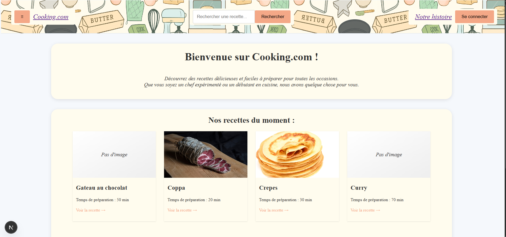
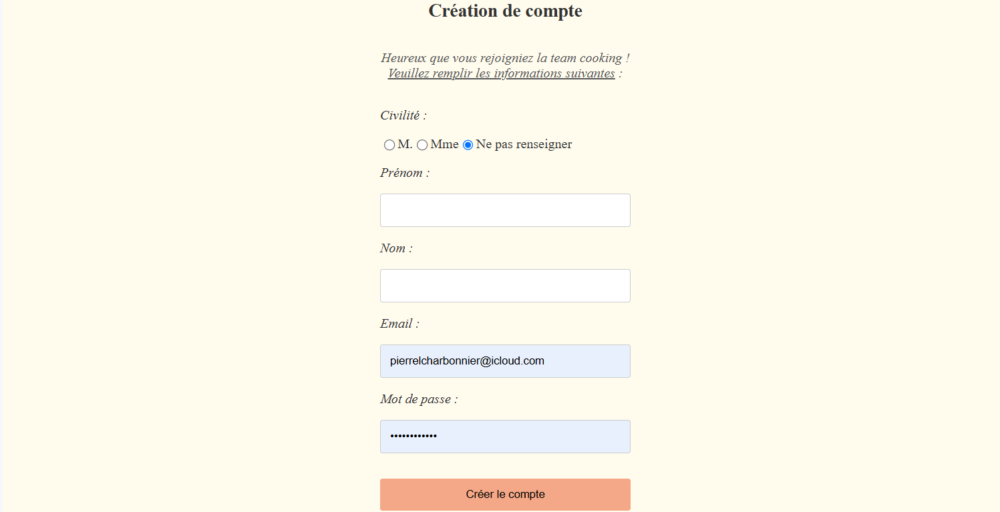
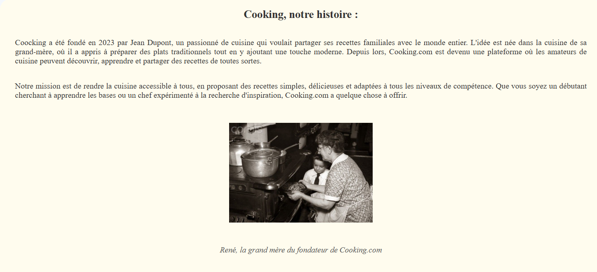
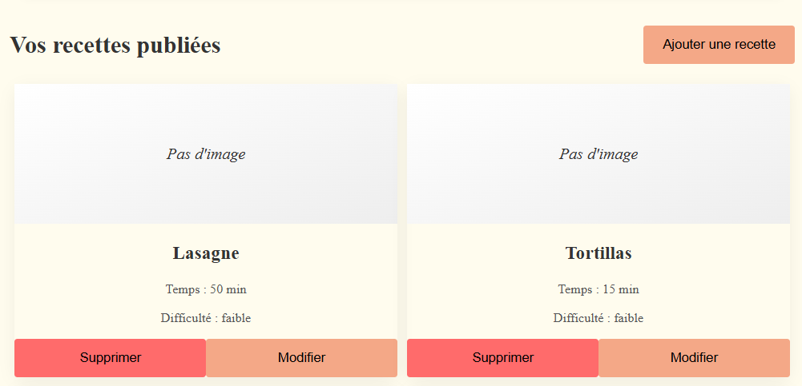
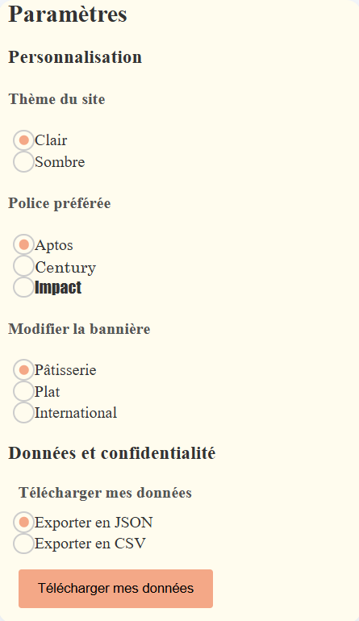
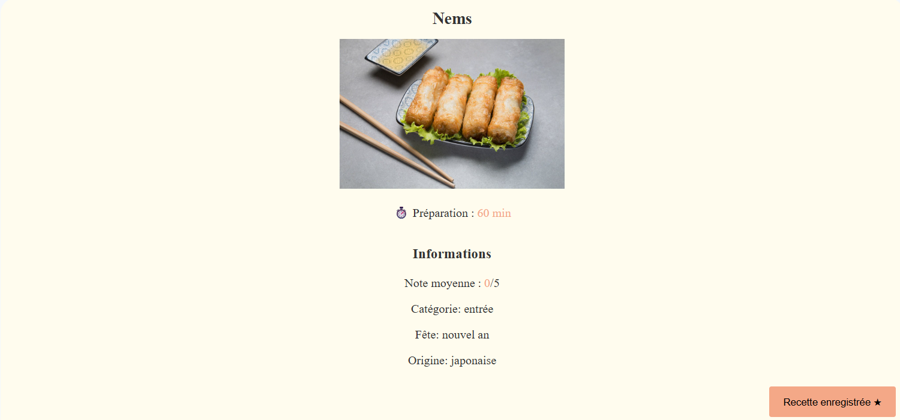
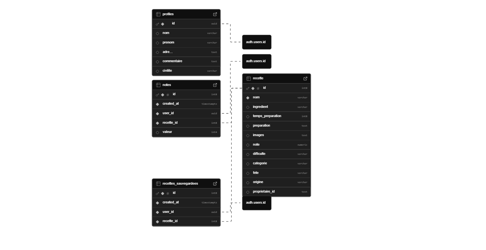
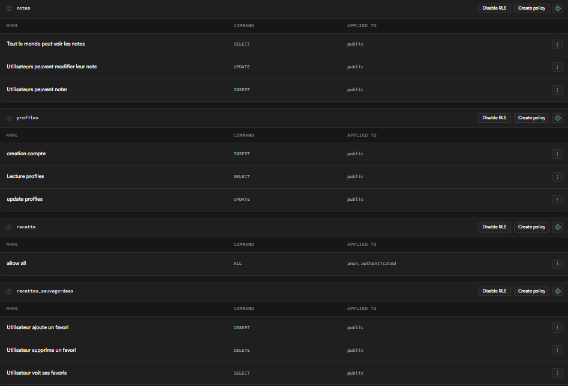

# Nom du Projet : Cooking.com

- **Membres de l'équipe :**
  - Charbonnier Pierre-Louis
  - Leoni Annabelle
- **URL du déploiement :** [(https://cooking-com.vercel.app/)]

---

## 1. Concept et expérience utilisateur

### Fonctionnalités Clés (UI/UX)

Page d'accueil:

Page d'inscription:

Page de connexion:

Page d'histoire:

Page du menu déroulant:

Page de compte publication de recette:

Page de personnalisation du compte:

Page des recettes:

---

## 2. Fonctionnalités Full-Stack

### Authentification

- [x] Inscription implémentée
- [x] Connexion implémentée
- [x] Déconnexion implémentée
- [x] L'interface se met à jour selon l'état de l'utilisateur

**Notes** : Nous avons implémenté un Triger  pour créer automatiquement un profil public dans la table `profiles` de supabase dès qu'un utilisateur s'inscrit dans `auth.users`. 

**Auto-évaluation** : 4.5/5 - Le flux est complet et sécurisé.

### Opérations CRUD

- **Ressource principale :** Recettes (Table `recette`)
- [x] Créer
- [x] Lire
- [x] Mise à jour
- [x] Supprimer

**Notes** : L'opération de création inclut l'upload d'images vers un Bucket Supabase Storage (`photos-recettes`). (**Nous avons également implémenté une fonctionnalité "Recettes Sauvegardées" (Favoris) qui agit comme une ressource CRUD secondaire.**)

**Auto-évaluation** : 5/5 - CRUD complet implémenté avec gestion d'images.

### Relations de données

- **Tables impliquées :** `users` (auth), `profiles`, `recette`, `notes`, `recettes_sauvegardees`.
- [x] Relation implémentée

**Notes** : Nous avons utilisé de nombreuses clés étrangères pour relier les tables de la bdd entre elles. Par exemple, `recettes_sauvegardees` lie un `user_id` à un `recette_id`. Nous effectuons des jointures SQL dans les requêtes Supabase pour récupérer les recettes favorites d'un utilisateur ainsi que les détails et la photo de la recette en une seule requête.

**Auto-évaluation** : 4/5 - Les relations entre les tables sont gérées correctement.

### Recherche & Filtrage

- [x] Recherche mise en oeuvre
- [x] Filtrage implémenté, options disponibles : Catégorie (Apéro, Plat...), Fête (Noël, Pâques...), Origine (Française, Italienne...).

**Notes** : La recherche et le filtrage sont gérés côté serveur dans `src/app/articles/page.tsx`.

**Auto-évaluation** : 5/5 - Le filtrage est efficace côté serveur.

### Intégration API Externe

- **API Utilisée :** Essayé d'utiliser ceette API avant la fin de la semaine: TheMealDB 
- **Données récupérées :** Essayer de récupérer els inspiration de recette internationale aléatoire.

**Notes** : Nous récupérons un plat aléatoire depuis cette API externe pour afficher une section "Inspiration Internationale", proposant du contenu qui ne se trouve pas dans notre base de données locale.

**Auto-évaluation** : 0/5 - Consigne non respectée.

---

## 3. Ingénierie et Architecture

### Schéma de Base de Données

Database:

**Notes** : Nous avons avons relié les tables entre elles grâce aux clées étrangères pour qu'elles puissent intéragir les unes avec les autres.

**Auto-évaluation** : 4/5 - Schéma normalisé et automatisé.

### Sécurité au niveau des lignes (RLS)

Tableau de bord RLS:

**Notes** :
- `recette` : Lecture, création authentifiée modification et Suppression des recettes par le propriétaire uniquement.
- `profiles` : Lecture modification d'un compte par le propriétaire.
- `notes` : Les utilisateurs ne peuvent insérer ou modifier que leurs propres notes ce qui empêche de voter plusieurs fois.

**Auto-évaluation** : 4/5 - La politique de sécurité a été respectée.

### Composants serveur et client

**Composant Serveur :** `src/app/articles/page.tsx` 
    - Le composant récupère la liste des recettes en fonction des paramètres de recherche de l'URL  depuis la base de données. Il ne nécessite pas d'interactivité utilisateur. 

**Composant Client :** `src/app/articles/[recettes]/page.tsx` 
    - Cette page est interactive avec l'utilisateur. Elle nécessite `useState` pour gérer la saisie de la note par exemple. 

---

## 4. Auto-réflexion & Retours

### Réussite dont vous êtes le plus fier

[Pierre-Louis] : L'implémentation du Trigger SQL pour le système de notation. Il a fallut faire en sorte que la base de données calcule automatiquement la moyenne et mette à jour la table recette sans avoir à faire de calcules trop volumineux.

[Annabelle] : L'architecture de la page "Mon Compte". Gérer plusieurs onglets comme les recettes publiées, paramètres... ainsi que l'utilisation de Tailwind CSS était difficile mais très enrichissant. Je suis surtout fier d'avoir implémenté le mode sombre sur le site car il m'a pris beaucoup de temps.

### Ce que vous amélioreriez

[Pierre-Louis] : Je pense qu'il faudrait ajouter une pagination à la page de liste des recettes, car charger toutes les recettes d'un coup pourrait devenir impacter la vitesse de chargement des recettes si la base de données devient trop volumineuse.

[Annabelle] : Pour ma part, j'implémenterais un aspect social qui permettrait aux utilisateurs de suivre d'autres chefs et de voir un fil d'actualité de leurs nouvelles recettes.

### Retour sur le cours (Bonus)

[Annabelle] : Les cours étaient assez intéressant mais j'ai trouvé dommage le manque d'aspect concret. Les premiers cours étaient très bien expliqués mais plus on approchait du front-end et plus je trouvais les cours abstraits et assez dur à mettre en pratique. 
[Pierre-Louis] : Pour ma part, j'ai trouvé les cours très interessants et j'ai trouvé que c'était une très bonne idée d'avancer petit à petit sur le projet dans nos cours de TP. Je suis cependant d'accord avec Annabelle sur le fait que plus on avançait et plus j'avais du mal à suivre les cours qui devenaient de plus en plus théorique. 
